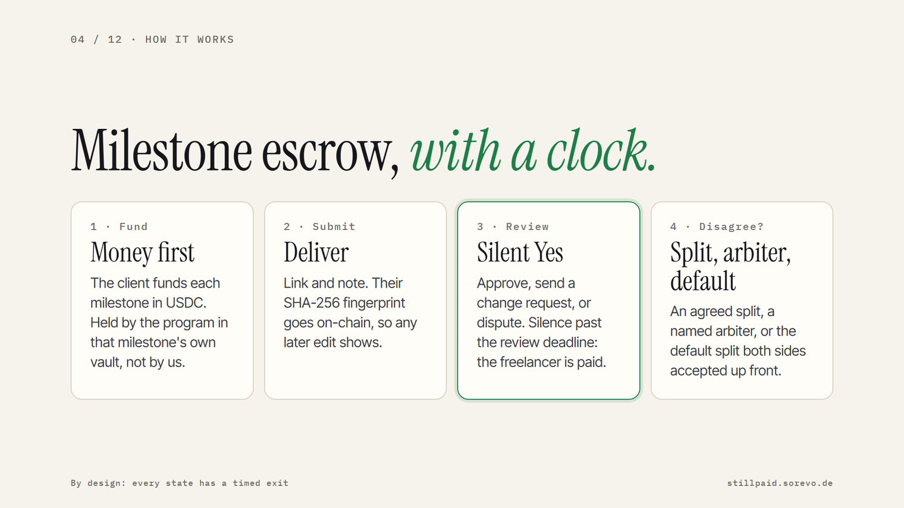
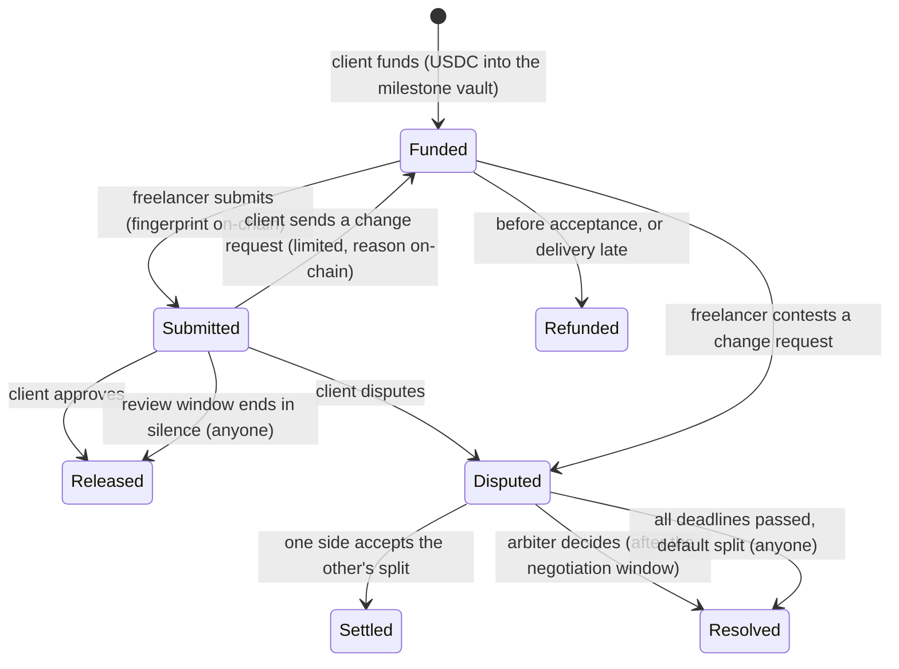

<p align="center">
  <picture>
    <source media="(prefers-color-scheme: dark)" srcset="brand/stillpaid-logo-dark.png">
    
  </picture>
</p>

<h3 align="center">Get paid on sign-off. Or on silence.</h3>

<p align="center">
  <a href="https://stillpaid.sorevo.de/demo"></a>
  <a href="https://stillpaid.sorevo.de/pitch/"></a>
  <a href="https://stillpaid.sorevo.de/pitch/demo.mp4"></a>
  <a href="https://github.com/NWichter/stillpaid/actions/workflows/ci.yml"></a>
  <a href="LICENSE"></a>
</p>

<p align="center">
  <a href="https://stillpaid.sorevo.de/pitch/"></a>
</p>

**[Live demo](https://stillpaid.sorevo.de/demo)** · **[Demo video](https://stillpaid.sorevo.de/pitch/demo.mp4)** · **[Pitch deck](https://stillpaid.sorevo.de/pitch/)** ([PDF](pitch/stillpaid-pitch.pdf)) · **[Program on devnet](https://explorer.solana.com/address/2gbyeNrQm2869HMK2mnSJyHc4cQfDrAGh6dk5ccoVyg4?cluster=devnet)** · [CI](https://github.com/NWichter/stillpaid/actions/workflows/ci.yml)

_still_ (German): quiet. _still_ (English): even so. If your client stays still, you still get paid.

Freelancers and agencies deliver the work, then wait. The client "still has to look at it", asks for one more change, or goes quiet. Paying across borders makes it worse: SWIFT fees, days in transit, or a marketplace that keeps 10 to 20 %.

Stillpaid brings **optimistic payments** to client work you found yourself, on Solana: like an optimistic rollup, a delivery becomes final unless the client objects in time. Think of Upwork's fixed-price protection without the marketplace, without the 10 to 20 % and without a custodian:

1. **Fund first.** The client puts each milestone in USDC into its own escrow account before work starts. The freelancer can see the money is there.
2. **Submit.** The freelancer submits a link and a note. Their SHA-256 fingerprint goes on-chain, so any later edit of the delivery shows.
3. **Review, with a clock.** Within the review window the client approves, sends one of the agreed change requests, or opens a dispute. **If the client says nothing, the delivery counts as accepted and anyone can release the payment.** This borrows the logic of German law's deemed acceptance (_fiktive Abnahme_, § 640 (2) BGB): silence past a deadline you set counts as acceptance, unless the client names a defect. Under the law nothing pays out automatically; with Stillpaid it does. Both parties agree to this rule up front, and Stillpaid executes its payment side. It does not decide who is legally right; warranty claims stay available through the courts.
4. **Disagree?** Both sides can agree on a split. If they cannot, a named arbiter decides. If nobody decides in time, the default split both sides accepted up front applies. By design, every state has a timed exit.

> Status: MVP for Superteam Germany's "Road to Colosseum: Build your MVP" and Colosseum's Crypto World's Fair (Solana track). Runs on **Solana devnet** with test tokens.
>
> Example: a milestone [paid on silence](https://explorer.solana.com/tx/fX5fb1FaMc5HfjT6RBtS9LMgfKfCAM6Xcf1PJcXMpjorwUDY6SGwvMhvdrx9eNCEYLc7fj6oAqTV3cEiYoMPHEZ?cluster=devnet), released by the crank, not the client.

## Try it in about five minutes

Open [`/demo`](https://stillpaid.sorevo.de/demo). No wallet needed: the first click creates a throwaway test wallet in your browser (or connect Phantom / Solflare on devnet). You need no SOL: the app pays the network fees.

- **Be the freelancer.** A demo client hires you and funds 25 test USDC. Accept, submit a delivery, and watch the 90-second review window run out. The demo client never answers, so the money lands in your wallet, and the job page links the payout transaction.
- **Be the client.** Get 100 test USDC and create a job for the demo freelancer. It usually accepts and delivers within 20 seconds. Approve, request a change, open a dispute and accept its split offer, or stay silent.

## How a milestone moves



## Rules the program enforces

| Situation                                                                           | What happens                                                                                                                                                                                                                    |
| ----------------------------------------------------------------------------------- | ------------------------------------------------------------------------------------------------------------------------------------------------------------------------------------------------------------------------------- |
| Client creates a job                                                                | names freelancer, optional arbiter, review / revision / negotiation / arbiter windows (1 h to 90 days; 1 min on test builds), max. change requests, the **default split** for unresolved disputes, SHA-256 of the written terms |
| Client funds a milestone                                                            | amount moves into the milestone's own vault; up to 20 milestones per job                                                                                                                                                        |
| Before the freelancer accepts                                                       | the client can take the money back at any time                                                                                                                                                                                  |
| Freelancer accepts                                                                  | from now on the client gets money back only if delivery is late or a dispute says so                                                                                                                                            |
| Freelancer submits (before the delivery deadline)                                   | SHA-256 of the delivery on-chain, review window starts                                                                                                                                                                          |
| Client approves                                                                     | 100 % to the freelancer                                                                                                                                                                                                         |
| Client sends a change request (within the window, while requests remain)            | back to the freelancer; the deadline is extended to at least the revision window, never shortened                                                                                                                               |
| **Review window ends in silence (Silent Yes)**                                                   | **anyone can release 100 % to the freelancer** (`release_on_silence`); the app does it automatically                                                                                                                            |
| Client disputes (within the review window), or freelancer contests a change request | negotiation window starts                                                                                                                                                                                                       |
| One side offers a split, the other accepts exactly that offer                       | paid out as agreed; accepting a changed offer fails                                                                                                                                                                             |
| Negotiation fails, arbiter named                                                    | only the arbiter decides, only after the negotiation window                                                                                                                                                                     |
| Nobody decides in time                                                              | anyone can trigger the default split agreed at creation; an odd base unit goes to the client                                                                                                                                    |
| Delivery deadline missed                                                            | the client takes the milestone back                                                                                                                                                                                             |
| Any payout                                                                          | happens once; a second payout of the same milestone fails on-chain                                                                                                                                                              |
| Settled milestone, kept on record (at least 30 days on mainnet)                     | whoever paid the rent can close it and gets the rent back; stray tokens go to the client                                                                                                                                        |
| Token-2022 mints                                                                    | rejected: only classic SPL tokens such as USDC (fees, hooks or delegates could drain a vault)                                                                                                                                   |

## Why Solana

- **Nobody holds the money.** Held by the program, not by us: each milestone sits in a program-owned account, and no Stillpaid key can move it outside the rules above. Stillpaid is designed so that no company ever holds client money. Today the program's upgrade authority is a single devnet key (see Limits); before mainnet it moves to a public multisig or the program is made immutable.
- **Deadlines enforce themselves.** After the review window, release is permissionless. The freelancer depends neither on the client nor on Stillpaid's server; any wallet can call it.
- **Cross-border in seconds.** USDC settles on-chain in seconds, for a fraction of a cent. The client does not need to set up Wise or Upwork for the freelancer, and the freelancer does not wait for SWIFT.
- **Evidence both sides can check.** Terms, deliveries and reasons stay off-chain, but their SHA-256 fingerprints and every state change are on-chain with timestamps. The job page re-hashes each text in the browser, shows whether it matches, and lists every step with its transaction.
- **No SOL needed.** The app is the fee payer and pays account rent, so a freelancer can start with an empty wallet. The rent comes back when settled milestones are closed.

## How it is built

```
Browser (Phantom / Solflare / demo wallet)   Express app (TypeScript)                   Solana program (Anchor 0.32)
──────────────────────────────────────────   ────────────────────────                   ────────────────────────────
/new, /j/:job, /demo  ── POST /api/tx ──────▶ builds + simulates the tx, unsigned      create_job, add_milestone, accept_job,
signs only            ◀─ tx ────────────────                                          submit, request_revision, open_dispute,
                                                                                        propose_split, approve, release_on_silence,
signed tx ─────────── POST /api/send ───────▶ only txs it built: co-signs as fee ─────▶ accept_split, resolve, fallback_split,
                                              payer, relays, counts the fee quota
                                              crank: silent milestones, due splits      refund, close_milestone, close_job
                                              rent reclaim, demo counterpart (devnet)
```

- `anchor/programs/stillpaid/src/lib.rs`: the program. `Job` (PDA of client + id), `Milestone` (PDA of job + index) with its vault (the milestone's associated token account).
- `app/`: server-rendered pages, transaction builder, crank, demo counterpart, text store (content-addressed; a text is kept once a transaction references its hash).
- `tests/program.test.ts`: 65 program tests against a local validator (in CI): every rule above including the time-based ones, account substitution, rent reclaim.
- `scripts/app-smoke.ts`: 34 end-to-end checks through the HTTP API, signing like a wallet: both demo flows, fee sponsoring and its limits, errors, on-chain activity.

## Integrate

Everything the app does, another app or program can do. The IDL is published on-chain (`anchor idl fetch 2gbyeNrQm2869HMK2mnSJyHc4cQfDrAGh6dk5ccoVyg4 --provider.cluster devnet`) and in [`anchor/target/idl/stillpaid.json`](anchor/target/idl/stillpaid.json).

| Account | Address |
| --- | --- |
| Job | PDA `["job", client, job_id as u64 little-endian]` |
| Milestone | PDA `["milestone", job, index as u16 little-endian]` |
| Vault | associated token account of the milestone PDA for the mint |

| Instruction | Signer | Notes |
| --- | --- | --- |
| `create_job`, `add_milestone` | client + payer | payer covers rent; can be a sponsor |
| `accept_job` | freelancer | |
| `submit` | freelancer | SHA-256 of the delivery |
| `approve`, `request_revision`, `open_dispute` | client | `open_dispute` also for the freelancer on a change request |
| `propose_split`, `accept_split` | client or freelancer | `accept_split` must repeat the exact offer |
| `resolve` | arbiter | only between the negotiation and the arbiter deadline |
| `release_on_silence`, `fallback_split` | **anyone** | permissionless once the deadline passed |
| `refund` | client | before acceptance, or after a missed delivery deadline |
| `close_milestone`, `close_job` | rent payer | after settlement plus the record period |

Every signer can be a PDA: a Squads vault or a DAO can be the client, a program can be the arbiter, and any keeper can run the two permissionless payouts. The program emits `JobCreated`, `JobAccepted`, `MilestoneFunded`, `Submitted`, `RevisionRequested`, `DisputeOpened`, `SplitProposed` and `Paid` (with the outcome, e.g. `silence`).

```ts
import { AnchorProvider, Program } from "@coral-xyz/anchor";
import idl from "./stillpaid.json";

const program = new Program(idl as any, provider);
// Anyone may release a milestone whose review window ended in silence:
await program.methods
  .releaseOnSilence()
  .accountsPartial({ actor, job, milestone, mint, vault, freelancerToken, clientToken })
  .rpc();
```

From Rust: `stillpaid = { git = "https://github.com/NWichter/stillpaid", features = ["cpi"] }`.

**Solana Actions (Blinks).** Every job is also an action at `/api/actions/job/<address>` (`/actions.json` maps job pages to it): release a milestone after silence, apply a due default split, accept the job, or fund another milestone, from any wallet or Blink client. Fees stay sponsored: the app signs as fee payer, the wallet adds its signature. Each job page links its Blink ([example on dial.to](https://dial.to/?action=solana-action%3Ahttps%3A%2F%2Fstillpaid.sorevo.de%2Fapi%2Factions%2Fjob%2FErNdQN3bEd36gWNUFHQXt1h7hPtSnR7rZaQyzr5D2EqJ&cluster=devnet)). Check: `npx tsx scripts/blink-check.ts`.

**A Squads multisig as the client.** [`scripts/squads-demo.ts`](scripts/squads-demo.ts) runs on devnet: a 2-of-2 Squads v4 multisig ([created](https://explorer.solana.com/tx/4hX5y1PJfNEHC7awbCUjjxsK8TRYfYmTfcqF7CSdRp9nYGXa4intPBgnNePsS5nSmyy97156BEE7viW8quj7qNXd?cluster=devnet)) funds a job from its vault ([executed](https://explorer.solana.com/tx/5BVBThcFaFTxT55v88X7ctcd8fXYW2HBwyVdToos6uEsGc6FPBLteHxdSfGbDc2rP3mdngaLeTW7jBrSnUmonmrS?cluster=devnet), [second milestone](https://explorer.solana.com/tx/4HW2WsFcjCgihEHp8HhNCUmJGv87CnkG4mUsRgCA3sgFALEmhuV5kMhzLv2iYX6nMHTkLEp3SoqQ6go4cD6PHEy5?cluster=devnet)), both members approve milestone 1 ([executed](https://explorer.solana.com/tx/4f4opDbUoVce68CfnZ6JpL3eMz8wN5XDbXKUeZuz6BBMsaKTAHuTZVLFmGSmWGnJVo37pVAfxDPUyvnhpe2HKaYt?cluster=devnet)), and milestone 2 is [released on silence](https://explorer.solana.com/tx/5K24qtKCW7TzLqcBvo4XpL72kDd28jmy3ZHTYjALB2B37f1BvCgLm6wMb1H6oQNzgALARLCLMB188DY78NDuvTMF?cluster=devnet) because the multisig never answered. [Job page](https://stillpaid.sorevo.de/j/ErNdQN3bEd36gWNUFHQXt1h7hPtSnR7rZaQyzr5D2EqJ).

## How it compares

- **Upwork / Fiverr** auto-release after 14 / 3 days of silence, but hold the money themselves; Upwork's take rate was 18.7 % in 2025. Direct Contracts cover clients you found yourself at about 5 %.
- **Escrow.com** also auto-accepts after an inspection period, as a licensed custodian, for 2.6 % with a $50 minimum.
- **Kleros Escrow** (EVM) lets anyone execute after a timeout that runs from the delivery deadline; disputes go to paid jurors, and the side that does not pay the fee loses.
- **Stillpaid**: the review clock starts at submission, change requests can only extend deadlines, and a dispute nobody decides ends in a split both sides fixed up front. Every state has a permissionless timed exit, and no company holds the money.

## Run it locally

Requirements: Node ≥ 20.18, the Solana CLI, Docker (for the pinned Anchor toolchain).

```bash
npm install
docker run --rm -v "$PWD/anchor:/workdir" -w /workdir solanafoundation/anchor:v0.32.1 anchor build
# Mainnet build (1-hour minimum windows, 30 days on record before close):
#   ... anchor build -- --no-default-features
# another terminal; the feature flag makes the local validator accept the same
# program binary as devnet does
solana-test-validator --deactivate-feature B8JJXCy5amZyWG9r7EnUYLwzXSXTxG7GZ1qZ1qggo83g
./scripts/deploy-local.sh
npm test                               # 65 program tests (~5 min: windows are ≥ 60 s)
npx tsx scripts/setup.ts localnet      # app wallets + test mint → .env
npm run app                            # http://localhost:4050
npm run app:smoke                      # 34 end-to-end checks (~3 min)
```

Environment: see `.env.example`. On devnet: `./scripts/deploy-devnet.sh`, then `npx tsx scripts/setup.ts devnet`.

## Deployment

|                      |                                                                   |
| -------------------- | ----------------------------------------------------------------- |
| Network              | Solana devnet                                                     |
| Program              | `2gbyeNrQm2869HMK2mnSJyHc4cQfDrAGh6dk5ccoVyg4`                    |
| Upgrade authority    | single devnet key (to move to a public multisig before mainnet)   |
| Verified build       | `solana-verify build --library-name stillpaid` in `anchor/` gives `fb8400695ce179da5c925b2f3a2b65ef63233b2e64cd7cb0a03b59cdf697cc05`, the same hash as `solana-verify get-program-hash -u devnet 2gbyeNrQm2869HMK2mnSJyHc4cQfDrAGh6dk5ccoVyg4` |
| IDL                  | on-chain, `anchor idl fetch 2gbyeNrQm2869HMK2mnSJyHc4cQfDrAGh6dk5ccoVyg4 --provider.cluster devnet` |
| Token                | our own test mint shown as USDC, `H6cSvmXCx6vDN5K8f4DVEwGjFSUCmJT9z5FQGtnc8xpB` (6 decimals, faucet on `/demo`); mainnet uses Circle's USDC |
| Silent Yes, end to end | job [`98UF…QkFX`](https://explorer.solana.com/address/98UFRc2taEozgka5v6LtQ5nV17z5YpYtfCnFigLrQkFX?cluster=devnet): [fund](https://explorer.solana.com/tx/wnSH5MYCYNsao4jbnXbtc9ZW3AAAzMFPUn6rWrGroqMYWEeMMKNsvkJb34GMTnXPUPm2E5vLKeKcB3R1LnnhrQ1?cluster=devnet) → [submit](https://explorer.solana.com/tx/4MtCkuFPhQRAT2zRoKncjtWvgdab21dXcXUbMmKguS6CRyJPSA79NujVmMvQpHc2asU6YQ1zgVpVAVy2ejz9wB5m?cluster=devnet) → [released on silence](https://explorer.solana.com/tx/fX5fb1FaMc5HfjT6RBtS9LMgfKfCAM6Xcf1PJcXMpjorwUDY6SGwvMhvdrx9eNCEYLc7fj6oAqTV3cEiYoMPHEZ?cluster=devnet) |
| Dispute, end to end | job [`AcrE…VpMF`](https://explorer.solana.com/address/AcrEA3AMFDshbxtC1fsN5N23KBvFFo5Kui96xo9mVpMF?cluster=devnet): [change request](https://explorer.solana.com/tx/2mpjLv3jtsmMMk9oqoEQgwD32579GSasPNFyKusapW6STJAq1fgFAyzhgGnYDwZDTrLUwnCUaPUT4nAD1D84iwBu?cluster=devnet) → [dispute](https://explorer.solana.com/tx/2a6HX49ttduDQCyUFSkDDk9V9a7Ks7k6EhVW9eRVtQBzSWnQxALRcMZuurb92Mf6yugygV6SVq8uzKG9eV9hFpUX?cluster=devnet) → [split offer](https://explorer.solana.com/tx/47dTsSAqjAfjnmhG51GV75MLBwFM6sMm8XmB5LuZZsm7MfSCfWD8qAVPbbDuXBukYiGsMzq9ZCHDYnb61oyVe66j?cluster=devnet) → [split paid 60/40](https://explorer.solana.com/tx/3UeYRHgVWPjH7w5FpsSBJvQKkoydHr3NhMmibcSdTZSUgMxffPfzrf2nVhayXQd8JZyDSQy5vuP3MsX78Jcj4emW?cluster=devnet); milestone 2 [approved](https://explorer.solana.com/tx/2DK8hhqe22uMEqTQukL2cExYC6Hb7eZTEGMNHiPmnScYS7oKaNJLsiTKbqAhYzt5b21o9E365NgBmvdvwto3L77w?cluster=devnet) |

## Business model

Free during the beta. Planned: 1 % of each released milestone, at least $2 and at most $100, paid by the client, against an 18.7 % take rate on Upwork (FY2025). Later: a flat fee per grant program or DAO, and paid expert arbiters.

- **Bottom-up (an assumption, not traction):** if 5 % of Superteam Earn's 2,720+ sponsors pay 4 freelancer milestones of $2,000 a month through Stillpaid, that is 136 × 48 × $2,000 × 1 % ≈ $130k a year.
- **Unit cost:** under $0.01 in network fees per milestone; the account rent comes back when a settled milestone is closed.
- **Go to market:** Superteam Earn sponsors and grant programs that already pay in milestones, then teams and DAOs that run their treasury on Squads.

## Limits

- Devnet and test tokens only. The program has had an internal security review, not an external audit; do not use it with real money yet.
- The upgrade authority is a single devnet key today.
- Stillpaid executes the payment side of an agreed rule; it is not legal advice. Deemed acceptance under German law applies to contracts for work (Werkvertrag) under German law, needs a reasonable period and, for consumers, a notice in text form. Review windows are part of the terms both sides accept; product templates default to 7 days.
- There are no e-mail or Telegram reminders yet. The client can add the review deadline to a calendar from the job page.
- USDC is an e-money token under MiCA. Exchanges that turn it into euros apply the EU Transfer of Funds Regulation and may ask users to prove wallet ownership. Paying in USDC changes nothing about tax: invoices (§ 14 UStG) and the reverse charge for cross-border B2B services (§ 13b UStG) still apply.
- The arbiter is a person both sides trust; Stillpaid does not provide arbitrators yet. Sanctions screening is not built.
- Texts are stored by the app; if the app is gone, the fingerprints still prove what was agreed, but the texts must come from the parties' own copies.

## License

[Apache License 2.0](LICENSE). The name and logo "Stillpaid" are not covered by the license (see [NOTICE](NOTICE)).
